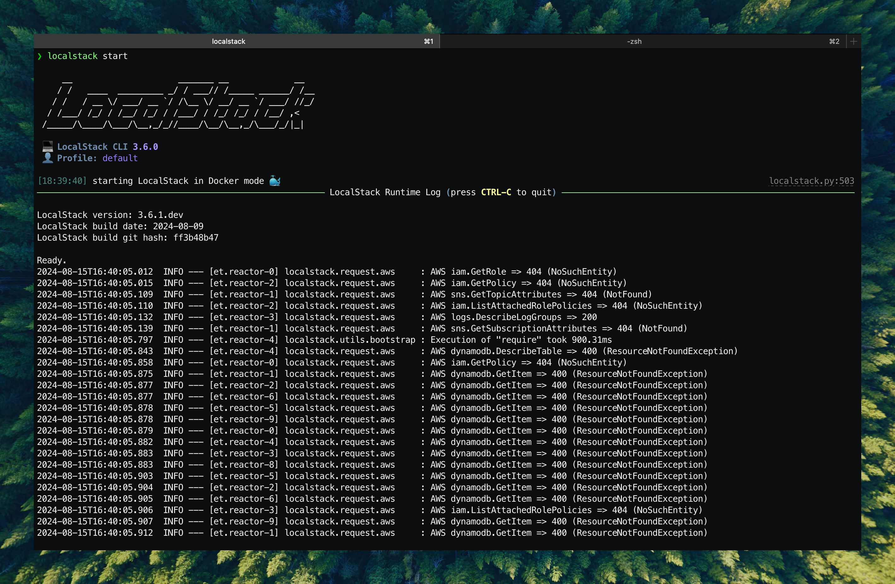
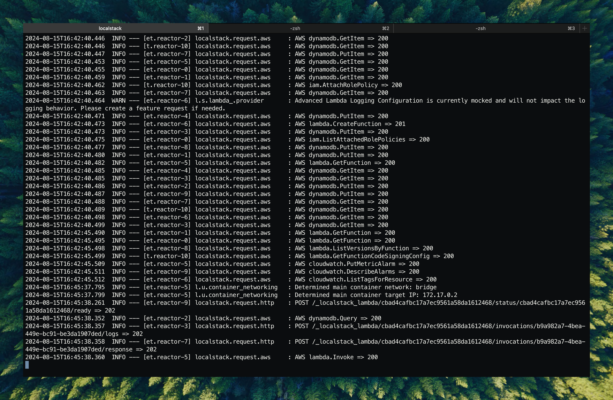
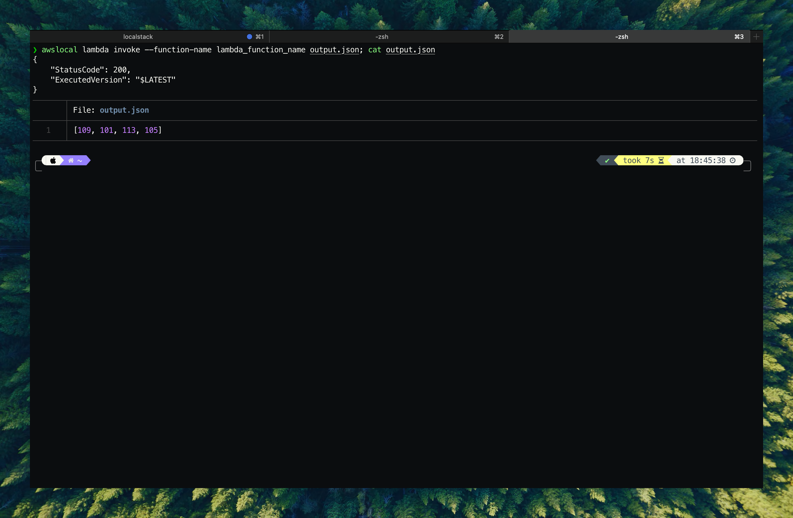

# Table of Contents

- [Assignment](#assignment)
  - [Tasks](#tasks)
  - [Lambda](#lambda)
  - [Dynamodb table structure](#dynamodb-table-structure)
    - [Attribute types](#attribute-types)
- [Solution](#solution)
  - [Tech Stack](#tech-stack)
  - [AWS LocalStack Installation](#aws-localstack-installation)
  - [DynamoDB Table](#dynamodb-table)
  - [Terraform Files](#terraform-files)
  - [Lambda Function](#lambda-function)
  - [DynamoDB and Global Secondary Index (GSI)](#dynamodb-and-global-secondary-index-gsi)
  - [Monitoring](#monitoring)
  - [Testing / Solution Verification](#testing--solution-verification)

# Assignment

The directory already contains code to create a lambda function in AWS using Terraform, however
the code is far from perfect and will require adjustment to function properly.

Note: The backend for terraform can be freely choosen.

## Tasks

1. Extend / fix the terraform infrastructure code
2. Implement the logic for the **lambda** function (any common scripting language of choice (py,js, go etc))
3. (Bonus) Implement monitoring

## Lambda 

Please write a lambda function that reads data from the 'users' dynamodb table and prints/returns the ids
only for entries that have both SSO and 2FA. To test the function you will need to populate the table with data. The section below shows how such a table should look like with regards to attributes.

## Dynamodb table structure

| Id          | Name            | Email                    | SSO | 2FA |
|-------------|-----------------|--------------------------|-----|-----|
| 12312313    | Mark Mustermann | test2mark@gmail.com      | N   | Y   |
| 12093103901 | Test User       | test@gmail.com           | Y   | N   |
| 12301301    | Random UserName | randomusername@gmail.com | N   | N   |

### Attribute types

* ID (N)
* Name (S)
* Email (S)
* SSO (BOOL)
* 2FA (BOOL)

# Solution

## Tech Stack

To solve the challenge, the following tech stack has been used:

- OpenTofu 1.7.3 (Terraform)
  - AWS Provider 5.62
  - Archive Provider 2.5.0
- Python 3.9
- AWS LocalStack 3.6.0
  - CloudWatch
  - DynamoDB
  - Lambda
- AWS Local CLI 2.17.15

## AWS LocalStack Installation

1. Install LocalStack:
    ```bash
    brew install localstack/tap/localstack-cli
    ```
2. Start LocalStack:
    ```bash
   localstack start
   ```
3. Install awslocal:
    ```bash
    brew install awscli-local
    ```

## DynamoDB Table

Populate the DynamoDB table using OpenTofu with the data provided in `dynamodb_data.json`.

| Id  | Name              | Email               | SSO | 2FA |
|-----|-------------------|---------------------|-----|-----|
| 101 | Alice Smith       | alice@example.com   | 1   | 1   |
| 102 | Bob Johnson       | bob@example.com     | 1   | 0   |
| 103 | Charlie Brown     | charlie@example.com | 0   | 1   |
| 104 | Diana Prince      | diana@example.com   | 0   | 0   |
| 105 | Ethan Hunt        | ethan@example.com   | 1   | 1   |
| 106 | Fiona Gallagher   | fiona@example.com   | 1   | 0   |
| 107 | George Washington | george@example.com  | 0   | 1   |
| 108 | Hannah Montana    | hannah@example.com  | 0   | 0   |
| 109 | Ian Malcolm       | ian@example.com     | 1   | 1   |
| 110 | Jessica Jones     | jessica@example.com | 1   | 0   |
| 111 | Kyle Reese        | kyle@example.com    | 0   | 1   |
| 112 | Lara Croft        | lara@example.com    | 0   | 0   |
| 113 | Marty McFly       | marty@example.com   | 1   | 1   |
| 114 | Nancy Drew        | nancy@example.com   | 1   | 0   |
| 115 | Oscar Wilde       | oscar@example.com   | 0   | 1   |

The User Ids with both SSO and 2FA enabled are: 

- 101, Alice Smith
- 105, Ethan Hunt
- 109, Ian Malcolm
- 113, Marty McFly

## Terraform Files

- `main.tf`: Contains configuration for Lambda and DynamoDB.
- `iam.tf`: Contains IAM roles and policies.
- `logging.tf`: Configures CloudWatch logging.
- `outputs.tf`: Outputs multiple values for testing.
- `providers.tf`: Configures the AWS provider, especially for LocalStack.
  - Endpoints for DynamoDB, Lambda, and CloudWatch are set to LocalStack.
  
## Lambda Function

The Lambda function is written in Python 3.9 and is located in `lambda_function.py`. It reads from the DynamoDB table using GSI and filters IDs based on SSO and 2FA attributes.

## DynamoDB and Global Secondary Index (GSI)

The DynamoDB table uses a Global Secondary Index (GSI) for efficient querying, as mentioned in the Developer Guide for AWS DynamoDB: https://docs.aws.amazon.com/amazondynamodb/latest/developerguide/GSI.html

```hcl
resource "aws_dynamodb_table" "users" {
  # other configuration
  global_secondary_index {
    name            = "SSO-2FA-index"
    hash_key        = "SSO" # The primary partition key for the index.
    range_key       = "2FA" # The secondary sort key within each partition.
    projection_type = "ALL" # Returns all attributes of the items in the index.
  }
}
```

Explanation:

- **Hash Key (SSO)**: The index partitions data based on the SSO attribute, allowing quick lookups for items with a specific SSO value.
- **Range Key (2FA)**: Within each partition, items are further sorted by the 2FA attribute.
- **Projection Type**: ALL: The index returns all attributes of the items that match the query, not just the attributes used in the index.

## Monitoring

Due to limitations in LocalStack, the CloudWatch metrics and alarms are not fully functional. However, the Terraform configuration for CloudWatch is provided in `logging.tf`.

**List Metrics:**

```bash

```hcl

```bash
❯ awslocal cloudwatch list-metrics

{
    "Metrics": [
        {
            "Namespace": "AWS/Lambda",
            "MetricName": "Invocations",
            "Dimensions": [
                {
                    "Name": "FunctionName",
                    "Value": "lambda_function_name"
                }
            ]
        }
    ]
}
```

**Describe Alarms:**

```bash
❯ awslocal cloudwatch describe-alarms

{
    "MetricAlarms": [
        {
            "AlarmName": "LambdaErrorAlarm",
            "AlarmArn": "arn:aws:cloudwatch:us-east-1:000000000000:alarm:LambdaErrorAlarm",
            "AlarmDescription": "Triggered when the Lambda function errors more than once within a minute",
            "AlarmConfigurationUpdatedTimestamp": "2024-08-15T15:27:14.946384+00:00",
            "ActionsEnabled": true,
            "OKActions": [],
            "AlarmActions": [
                "arn:aws:sns:us-east-1:000000000000:lambda_alerts"
            ],
            "InsufficientDataActions": [],
            "StateValue": "INSUFFICIENT_DATA",
            "StateReason": "Unchecked: Initial alarm creation",
            "StateUpdatedTimestamp": "2024-08-15T15:27:14.946384+00:00",
            "MetricName": "Errors",
            "Namespace": "AWS/Lambda",
            "Statistic": "Sum",
            "Dimensions": [
                {
                    "Name": "FunctionName",
                    "Value": "lambda_function_name"
                }
            ],
            "Period": 60,
            "EvaluationPeriods": 1,
            "Threshold": 1.0,
            "ComparisonOperator": "GreaterThanThreshold",
            "TreatMissingData": "missing",
            "StateTransitionedTimestamp": "2024-08-15T15:27:14.946384+00:00"
        }
    ],
    "CompositeAlarms": []
}
```

## Testing / Solution Verification

To test the Lambda function, invoke it locally using LocalStack:

```bash
awslocal lambda invoke --function-name lambda_function_name output.json; cat output.json
```




You should see the IDs of users with both SSO and 2FA enabled in output.json.

```bash
{
    "StatusCode": 200,
    "ExecutedVersion": "$LATEST"
}
───────┬──────────────────────────────────────────────────────────────────────────────────────────────────────────────────────────────────────────────────────────
       │ File: output.json
───────┼──────────────────────────────────────────────────────────────────────────────────────────────────────────────────────────────────────────────────────────
   1   │ [109, 101, 113, 105]
───────┴──────────────────────────────────────────────────────────────────────────────────────────────────────────────────────────────────────────────────────────
```


